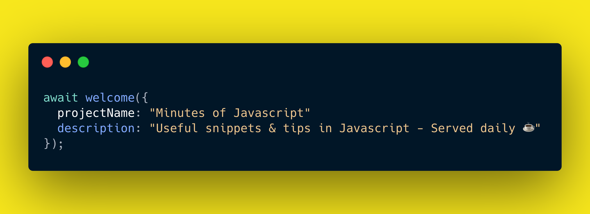

[![MIT License][license-shield]][license-url]
[![Stargazers][stars-shield]][stars-url] [![Forks][forks-shield]][forks-url] [![Issues][issues-shield]][issues-url] 

<!-- PROJECT LOGO -->
 

  

  <h3 align="center"><strong>{ Minutes of Javascript }</strong></h3>
  

    <a href="https://github.com/olivierloverde/minutes-of-javascript/issues">Report Bug</a>
    ·
    <a href="https://github.com/olivierloverde/minutes-of-javascript/issues">Request Feature</a>
  

<!-- TABLE OF CONTENTS -->

  
<h2 style="display: inline-block">Table of Contents</h2>

  <ol>
    <li><a href="#-about-the-project">About The Project</a></li>
    <li><a href="#-minutes-listing">Minutes listing</a></li>
    <li><a href="#-contributing">Contributing</a></li>
    <li><a href="#-license">License</a></li>
    <li><a href="#%EF%B8%8F-contact">Contact</a></li>
    <li><a href="#-acknowledgements">Acknowledgements</a></li>
  </ol>

<!-- ABOUT THE PROJECT -->
## 👋 About The Project

Javascript pieces of code to make you discover new exciting features, useful tips or anything that will give you a better understanding of the subtleties of JS. This repository serves as a central location for all theses snippets. 

<!-- USAGE EXAMPLES -->
## ⭐ Minutes listing

1. [Switch statement vs Object Search](snippets/01-object-search.js)
2. [.map() & .reduce()](snippets/02-array-map-reduce.js)
3. [Methods for merging (aka concatenating) arrays](snippets/03-methods-for-merging-arrays.js)
4. [Using Map() vs Object literals](snippets/04-map-vs-object-literals.js)
5. [Weakmap()](snippets/05-weakmap.js)
6. [Sets in ES6](snippets/06-sets-in-es6.js)
7. [Promises](snippets/07-promises.js)
8. [Promises Part 2.](snippets/08-promises-async-await.js)
9. [Promise.all vs Promise.allSettled](snippets/09-promise-all-vs-promise-allsettled.js)
10. [Promise.race](snippets/10-promise-race-any-join.js)
11. [Proxies Part 1. introduction](snippets/11-proxies-part-1.js)
12. [Proxies Part 2. (with Reflect)](snippets/12-proxies-part-2-with-reflect.js)
13. [Proxies Part 3. makeReadOnly example](snippets/13-proxies-part-3.js)
14. [flat() and flatMap()](snippets/14-flat-flatmap.js)
15. [ Fun with Emoji!](snippets/15-fun-with-emoji.js)
16. [Some bizarre things in Javascript](snippets/16-bizarre-javascript.js)
17. [Breaking in nested loops](snippets/17-breaking-nested-loops.js)
18. [EventEmitter](snippets/18-eventemitter.js)
19. [How to implement a local EventEmitter? (part 1.)](snippets/19-implement-eventemitter-part1.js)
20. [How to implement a local EventEmitter? (part 2.)](snippets/20-implement-eventemitter-part2.spec.js)
21. [Using "_" in numbers for better readability](snippets/21-tips-underscore-number.js)
22. [Array: .map() vs .filter() vs .reduce()](snippets/22-map-vs-filter-vs-reduce.js)
23. [Generator function* and yield usage](snippets/23-generator-function-yield-usage.js)
24. [Usage of switch (true), an example with numeric ranges](snippets/24-usage-of-switch-with-numeric-ranges.js)
25. [Symbols: property keys without name collisions](snippets/25-symbols-property-keys-without-name-collisions.js)
26. [The void operator](snippets/26-void-operator.js)
27. [Using new Set() to get rid of duplicate values in array](snippets/27-set-duplicate-values-array.js)
28. [Object destructuring on Array](snippets/28-object-destructuring-array.js)

<!-- CONTRIBUTING -->
## 🌈 Contributing

Contributions are what make the open source community such an amazing place to be learn, inspire, and create. Any contributions you make are **greatly appreciated**.

1. Fork the Project
2. Create your Feature Branch (`git checkout -b feature/AmazingFeature`)
3. Commit your Changes (`git commit -m 'Add some AmazingFeature'`)
4. If you're writing a new snippet, do not forget to update the <a href="#-minutes-listing">Minutes listing</a> section accordingly
5. Push to the Branch (`git push origin feature/AmazingFeature`)
6. Open a Pull Request

<!-- LICENSE -->
## 💾 License

Distributed under the MIT License. See `LICENSE` for more information.

<!-- CONTACT -->
## ✉️ Contact
[![Twitter][twitter-shield]][twitter-url]
[![Linkedin][linkedin-shield]][linkedin-url]

<!-- ACKNOWLEDGEMENTS -->
## 🙏 Acknowledgements

* [Carbon](https://carbon.now.sh/) - Create and share beautiful images of your source code

[contributors-shield]: https://img.shields.io/github/contributors/olivierloverde/minutes-of-javascript.svg?style=for-the-badge
[contributors-url]: https://github.com/olivierloverde/minutes-of-javascript/graphs/contributors
[forks-shield]: https://img.shields.io/github/forks/olivierloverde/minutes-of-javascript.svg?style=for-the-badge
[forks-url]: https://github.com/olivierloverde/minutes-of-javascript/network/members
[stars-shield]: https://img.shields.io/github/stars/olivierloverde/minutes-of-javascript.svg?style=for-the-badge
[stars-url]: https://github.com/olivierloverde/minutes-of-javascript/stargazers
[issues-shield]: https://img.shields.io/github/issues/olivierloverde/minutes-of-javascript.svg?style=for-the-badge
[issues-url]: https://github.com/olivierloverde/minutes-of-javascript/issues
[license-shield]: https://img.shields.io/github/license/olivierloverde/minutes-of-javascript.svg?style=for-the-badge
[license-url]: https://github.com/olivierloverde/minutes-of-javascript/blob/main/LICENSE
[linkedin-shield]: https://img.shields.io/badge/-LinkedIn-black.svg?style=for-the-badge&logo=linkedin&colorB=555
[linkedin-url]: https://linkedin.com/in/olivierloverde
[twitter-shield]: https://img.shields.io/badge/-Twitter-black.svg?style=for-the-badge&logo=Twitter&colorB=555
[twitter-url]: https://twitter.com/loverdeolivier
